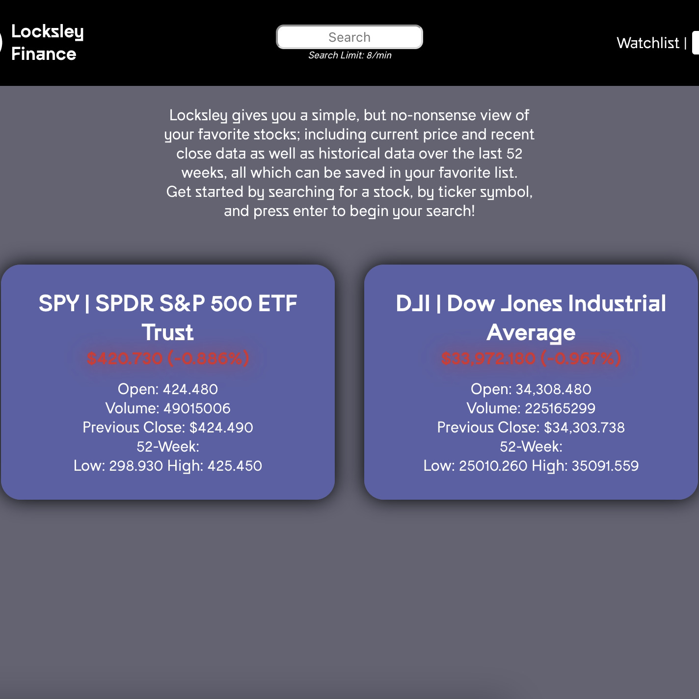
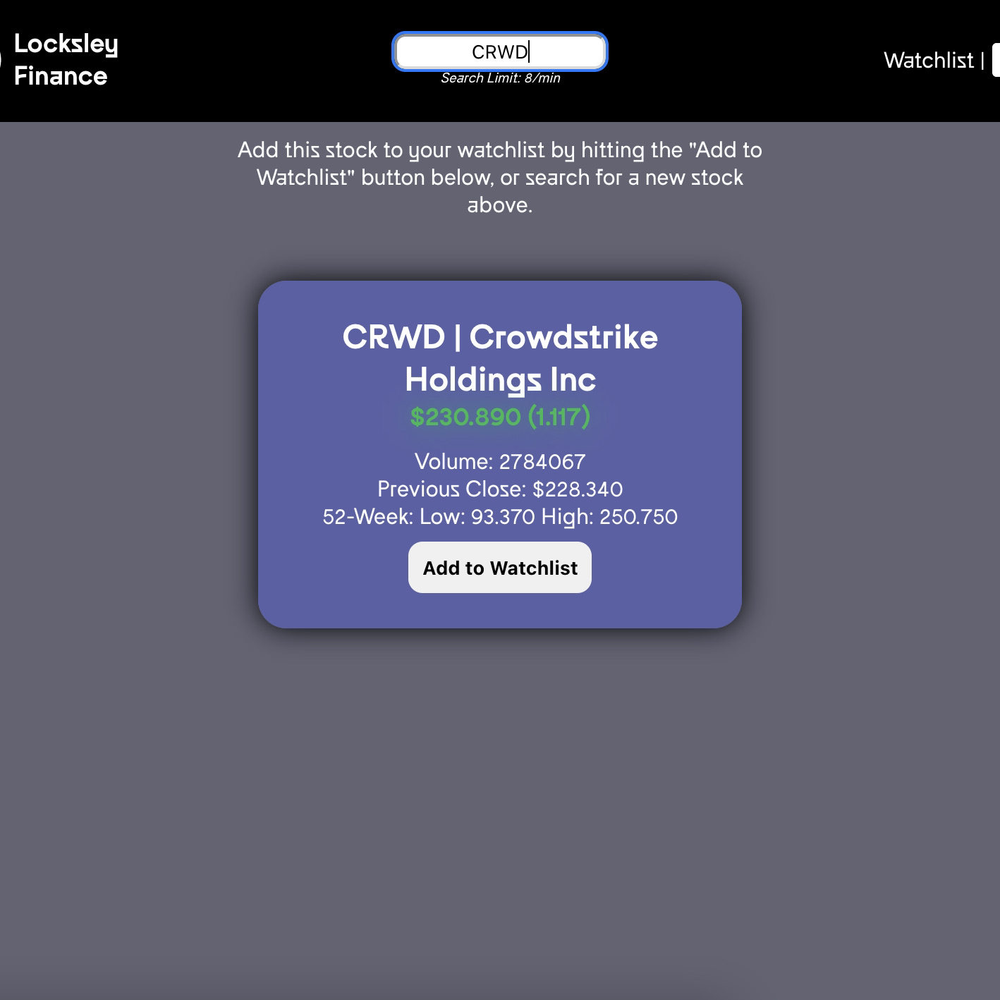
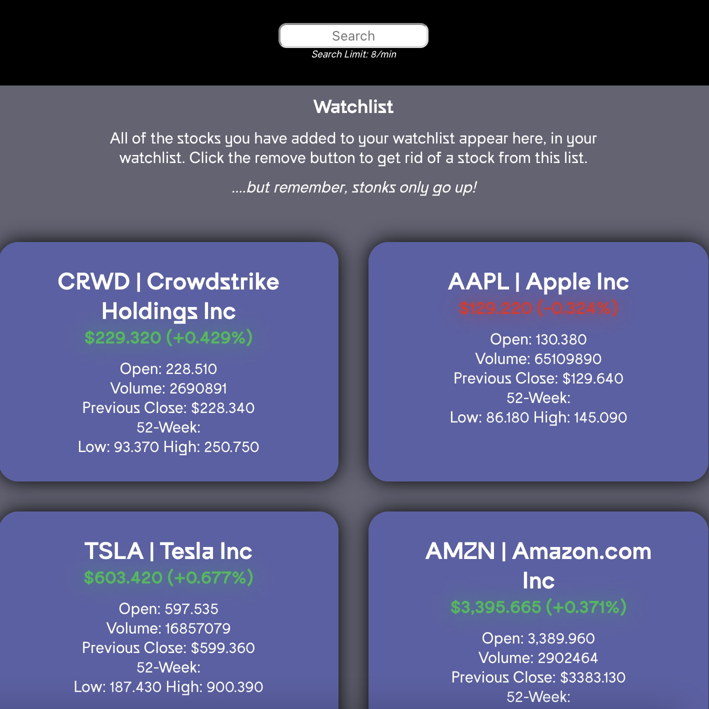

# Locksley Finance

## Summary: 

The purpose of Locksley Finance is to give users a simple tool to search, track and stay up to date on a handful of their favorite stocks they'd like to keep tabs on. 
Locksley Finance is a React web application that allows users to call a public stock API, [twelvedata](https://twelvedata.com/), Users may search for stocks by ticker symbol, save/remove them to/from their watchlist as well as refresh all of the data for the stocks in their watchlist in order to get the latest prices and information.

## Technology

Locksley Finance was made using a server-side program that can be found here: 
* [Locklsey-Server](https://github.com/zacharyjameson/locksley-server)

Technology Used:
* React
* JSX
* PostgreSQL
* Node.js
* JavaScript
* Express
* Vercel
* Heroku
* HTML/CSS

## Live Version
[Locksley Finance](https://locksley.vercel.app/)

## Screenshots

### Home

### Search Results

### Wachlist
